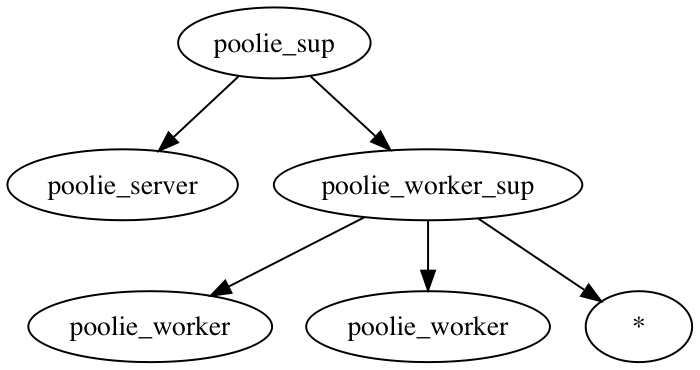

# Worker Pool

## Reading material

- [Learn You Some Erlang: Who Supervises The Supervisors?](https://learnyousomeerlang.com/supervisors)
- [Learn You Some Erlang: Building an Application With OTP](https://learnyousomeerlang.com/building-applications-with-otp)

## Exercise

For this exercise create a pool of workers to compute a standard `{M, F, A}` or `{F, A}`. 

You will write a `gen_server` that controls the pool of workers.  
The supervision tree will look like this:  
  


In `poolie_sup` and `poolie_worker_sup` you will define appropriate supervision strategies.

`poolie_server` will implement the following functions:  
- `run/3`: Takes a module, a function and a list of args and dispatches the computation to an idle worker. If all workers are busy, asks user to try again later.
- `run/2`: Same as `run/3`, but only takes a function and a list of args.
- `gen_server` callbacks to handle initialization and communication with workers.

### Example
```console
1> poolie_server:run(fun(X) -> X + 1 end, [5]).
Request is being processed
ok

Got results for {#Fun<erl_eval.6.128620087>,[5]}
Result: 6

2> poolie_server:run(lists, max, [[1,2,3,4,5]]).
Request is being processed
ok

Got results for {lists,max,[[1,2,3,4,5]]}
Result: 5
```


Notes:
- Think about what supervisor strategies you should use.
- Should you use `gen_server:call` or `gen_server:cast` to send work to your workers?
